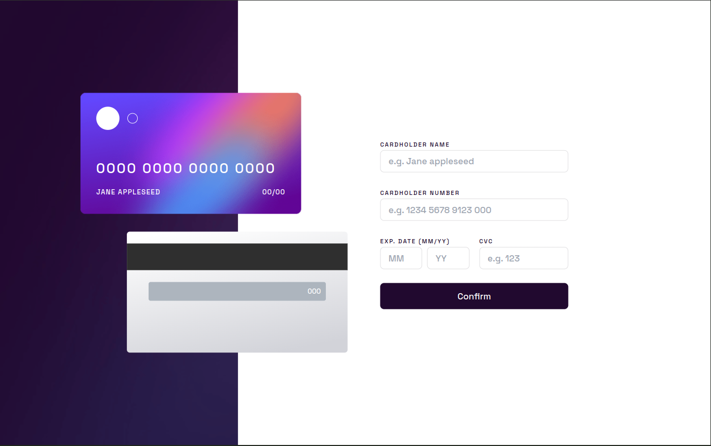

# Frontend Mentor - Interactive card details form solution

This is a solution to the [Interactive card details form challenge on Frontend Mentor](https://www.frontendmentor.io/challenges/interactive-card-details-form-XpS8cKZDWw). Frontend Mentor challenges help you improve your coding skills by building realistic projects.

## Table of contents

-   [Overview](#overview)
    -   [The challenge](#the-challenge)
    -   [Screenshot](#screenshot)
    -   [Links](#links)
-   [My process](#my-process)
    -   [Built with](#built-with)
    -   [Continued development](#continued-development)
-   [Author](#author)

## Overview

### The challenge

Users should be able to:

-   Fill in the form and see the card details update in real-time
-   Receive error messages when the form is submitted if:
    -   Any input field is empty
    -   The card number, expiry date, or CVC fields are in the wrong format
-   View the optimal layout depending on their device's screen size
-   See hover, active, and focus states for interactive elements on the page

### Screenshot

### Links

-   Solution URL: [https://www.frontendmentor.io/solutions/responsive-card-details-with-react-react-hook-form-tailwindcss-OAmMuidD5N](https://www.frontendmentor.io/solutions/responsive-card-details-with-react-react-hook-form-tailwindcss-OAmMuidD5N)
-   Live Site URL: [https://frontendmentor-card-five.vercel.app/](https://frontendmentor-card-five.vercel.app/)

## My process

### Built with

-   Flexbox
-   CSS Grid
-   Mobile-first workflow
-   [React](https://reactjs.org/) - JS library
-   [Vite](https://vitejs.dev/) - React bundler
-   [Tailwind](https://tailwindcss.com/) - CSS utilities
-   [React hook form](https://react-hook-form.com/) - React hook form

### Continued development

Exercice validation is a bit simplist, we could add some more rules to check if the card has expired for example.

## Author

-   Website - [Jason savelli](https://jasonsavelli.fr)
-   Frontend Mentor - [@Newpoki](https://www.frontendmentor.io/profile/Newpoki)
